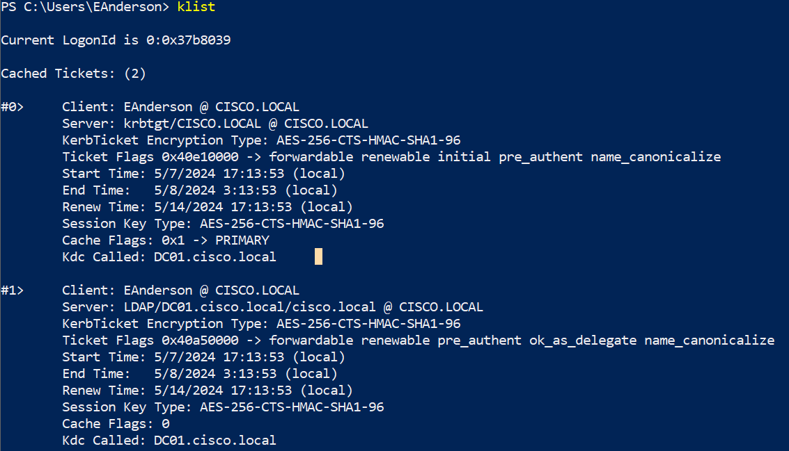

# AS-REQ Roast

## ORIGEN DE UN AS-REQ ROAST

---

Este ataque ocurre con la captura un paquete de Kerberos del tipo `KRB_AS_REQ` en el primer intercambio entre el cliente y el Domain Controller. En una petición `KRB_AS_REQ` se encuentra el **nombre de usuario** que realiza la petición, el **nombre de dominio** y un **timestamp cifrado** con la contraseña del usuario. Con estos datos podemos estructurar un hash que luego podemos intentar crackear para adquirir la contraseña de ese usuario.

El hash se sigue la siguiente estructura:

```bash
$krb5pa$18$NOMBRE_USUARIO$DOMINIO$TIMESTAMP_CIFRADO
```

Antes de capturar los paquetes con fines educativos primero vamos a eliminar los TGT que se han pedido antes desde el cliente para forzar que se realice la petición `KRB_AS_REQ`, para ellos vamos a abrir una powershell en el equipo cliente y con el comando ***`klist`*** listamos para ver los TGTs que tiene ese cliente.



Y con ***`klist purge`*** limpiamos dichos TGTs.


Para capturar el paquete utilizaremos wireshark y aplicaremos el filtro ***`kerberos.as_req_element`***.


Luego desde el cliente accederemos a cualquier recurso SMB existente, tal como lo haría un usuario normal, con el fin de que se produzca la autenticación de Kerberos.


Si miramos el wireshark veremos algunos paquetes del tipo `AS-REQ`.


Buscaremos el paquete que contenga los valores cipher, CNameString y realm.


## CRACKEO DE LOS HASHES ENCONTRADOS

---

Para crackear este hash con Hashcat solo introducimos el hash en un archivo de texto y hacemos uso del siguiente comando indicando que el módulo que usaremos será el 19900, el tipo de ataque será de fuerza bruta y, por último, el archivo donde se encuentra el hash y el diccionario que usaremos para crackear la contraseña.

```bash
hashcat -a 0 -m 19900 ARCHIVO_HASH DICCIONARIO
```